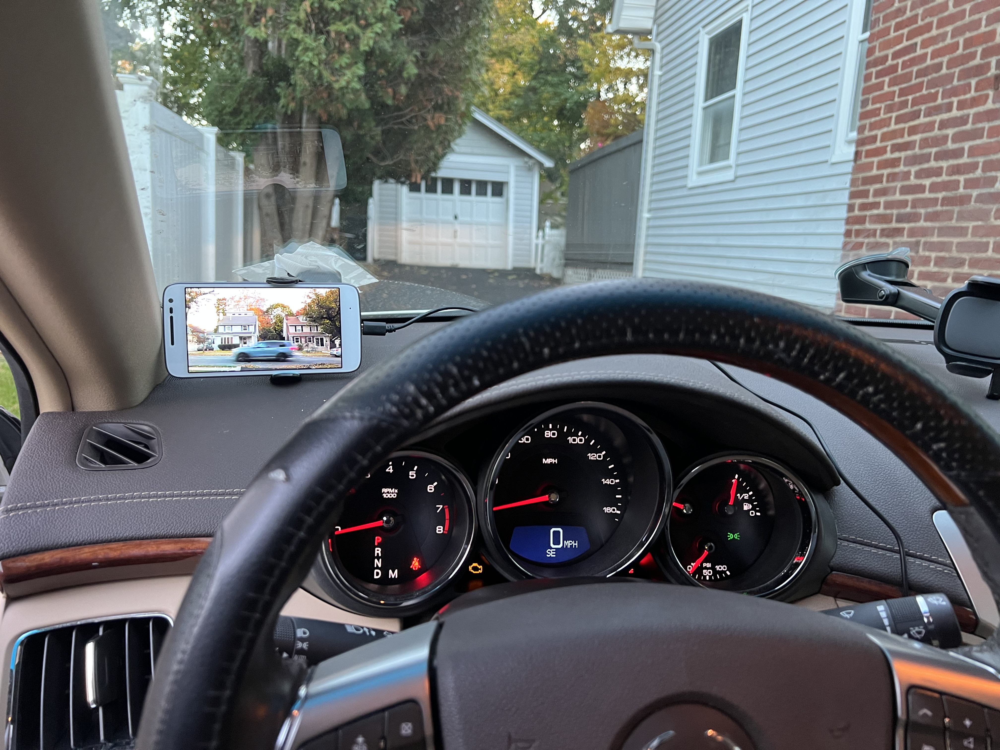
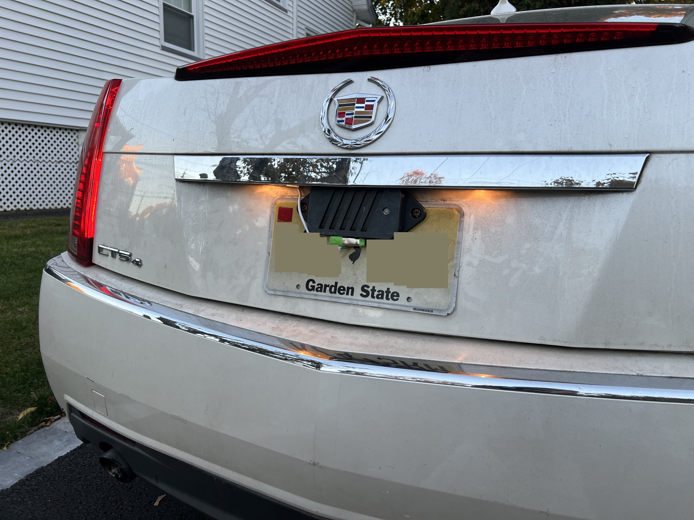

## Close Circuit (Weekend Project #3)

    
    

> Close Circuit is running on the phone mounted on the dashboard.
> The phone in the back is running the IP Webcam app, linked below.

> [The license plate mount is of my own design, you can download the .STEP and .STL for remixing or printing here.](https://www.printables.com/model/1050371-zte-speed-license-plate-mount)

Close as in close-by, not close as in shut down. 

This project lets you create a PAN surveillance system using WiFi and IP Webcams. The monitor functions as an AP using the Wi-Fi Direct APIs, and can have multiple Wi-Fi cameras connected to it. 

The monitor runs the CC app (contained in the `app` directory), and the cameras may be either traditional IP cameras or Android devices running the [Android IP Webcam](https://play.google.com/store/apps/details?id=com.pas.webcam&hl=en_US) app.

## Using

When the app first launches, it will display a QR code that you can scan with your camera device to connect to the monitor. It will also show the SSID and password that you can use to connect to the monitor manually.

When the monitor detects that any IP webcams with an HTTP server at port 8080 and with an MJPEG stream at `/video` are connected to it, it will display the video feed from the first camera it finds. If the camera disconnects, the monitor will remove it from view but will continue to attempt a connection in the background.

## Building & Installing

Considering the apps more prototype-y state than my other projects, I haven't created any releases. However, the build is entirely reproducible, so you may clone it and build it yourself.

If you would like to see this app have an official release, please let me know by opening an issue.

## Applications

* Camps in the wilderness
* Backup/front camera for your car ([land yacht!](https://www.tiktok.com/@insanegnyc/video/7258434298699861294?q=camera%20%23cadillacescalade&t=1729559185863))
* Baby monitors (no sound implemented)

## Requirements

* WiFi support
* Android 6.0 or later
* Some devices to use as cameras ([Android IP Webcam](https://play.google.com/store/apps/details?id=com.pas.webcam&hl=en_US) supports KitKat and later)
